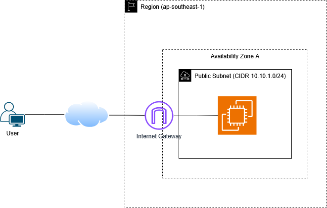
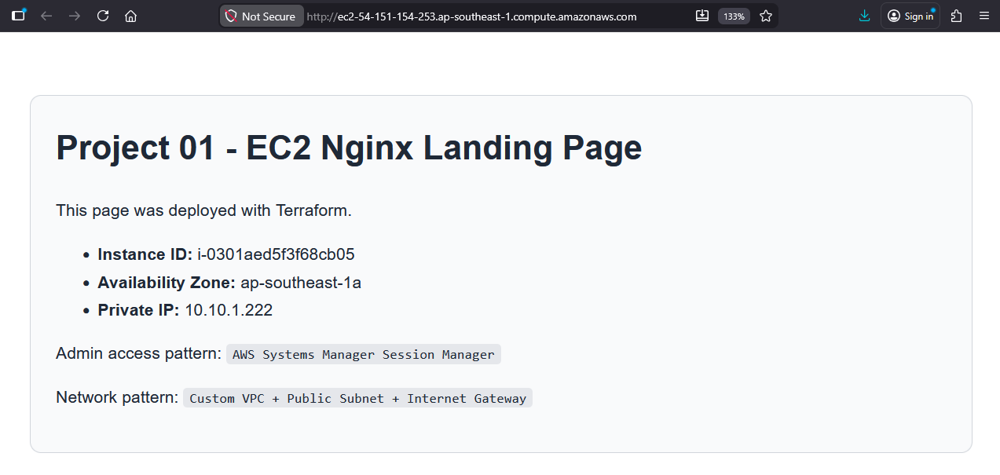

# Project 01 — Production static web entrypoint on EC2

### 1. Business requirement

A small startup needs a temporary public landing page for a new product launch. \
Requirements:
+ an AWS VPC
+ one Linux server hosting a simple Nginx page
+ browser access over HTTP
+ no SSH exposure
+ low cost
+ clear monitoring
+ Terraform-managed infrastructure from day one

### 2. Architecture design

*Core design*

One VPC, one public subnet, one internet-facing EC2 instance, one security group, one IAM instance profile for Systems Manager, and two CloudWatch alarms.
This is the correct first project because it teaches the foundations that every larger AWS system depends on:

+ VPC and subnetting
+ routing and internet gateway
+ security groups
+ IAM role attachment to EC2
+ AMI selection without hard-coding
+ bootstrap with user data
+ monitoring and alarm basics

*Limitations*

This is not highly available. One instance in one subnet means this is a single failure domain. That is acceptable for this project because the goal is low cost and foundational structure. 
The future project phase should add ALB, Auto Scaling, private subnets, and multi-AZ.

*AWS services used*

+ Amazon VPC — isolated network
+ Internet Gateway — internet access for public subnet
+ EC2 — compute host
+ IAM Role + Instance Profile — Systems Manager access
+ AWS Systems Manager Parameter Store — dynamic AMI resolution
+ CloudWatch — alarms for CPU and status checks

*Network design*

+ VPC CIDR: 10.10.0.0/16
+ Public subnet: 10.10.1.0/24
+ Internet route: 0.0.0.0/0 -> Internet Gateway
+ Security group inbound: HTTP 80 from 0.0.0.0/0
+ Security group outbound: all traffic allowed
+ No SSH port 22
+ EC2 gets public IP
+ IMDSv2 required

*Data flow*

1. User opens the website URL in a browser.
2. Request travels over the internet to the EC2 instance public IP/DNS.
3. Security group allows inbound TCP 80.
4. Nginx serves static HTML from /usr/share/nginx/html/index.html.
5. Instance egress goes directly through the internet gateway for package install and updates.
6. Operator access is done through Systems Manager, not SSH.
7. CloudWatch tracks CPU and status checks and raises alarms when thresholds are crossed. AWS documents EC2 basic monitoring as 5-minute granularity and detailed monitoring as 1-minute granularity.

*Architecture Diagram*

### 3. Deployed Result

